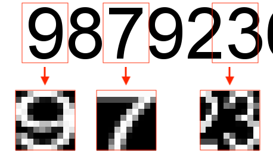
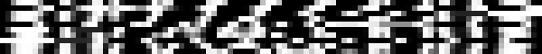
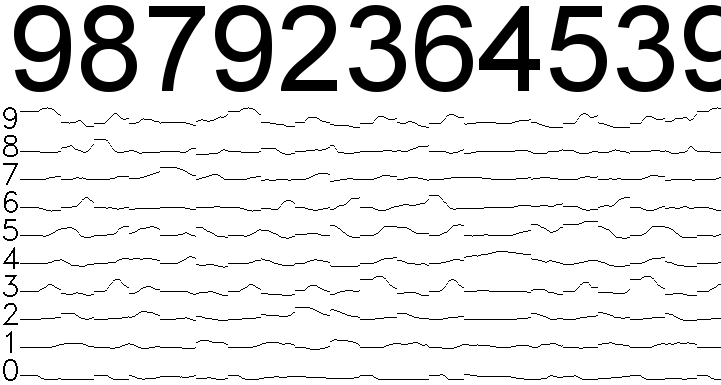

# DigitPixels

Applying OpenCV Neural Network to an image to recognize digits.

### Dependencies

To easily compile and run project install following list of dependencies:

- **pkg-config**
- **GNU/Make**
- **OpenCV**

## How does it work?

### Preparing input images

From input image

- Rectangle of Interest is taken
- Gaussian blur filter is applied
- resize to 10x10 is done
- conversion to 32 bit float depth, single channel (**CV_32FC1**) is done on the obtained matrix

Process is visualized by the image below:



### Training data

Each matrix representing learnt digit/character is reshaped to 1x100 size, pushed to the **training data** matrix as single row - number of columns corresponds with the count of input neurons (100). At the same time, on the same row number of training outputs matrix a row containing expected output (for the training data representing the digit) is pushed - matrix 1x10 with zeros on all positions except position representig digit for which data are being inserted. For this position value 1 is set. 

Visualization of training input data:



Visualization of training expected outputs:


## Compile and run

### Compile

Clone repository in the command line, change directory to the one containing the repository content and run **make** command.

```shell
git clone https://github.com/adamgic/DigitPixels.git
cd DigitPixels
make
```

### Run

Run passing path to directory containing training set as first argument and name of input image as second argument.

```shell
./DigitRecognizer digits/ inputImage.png 
```

You will see output visualization containing excitation diagram for each output neuron depending on the shift of Rectangle of Interest along the input image. It is easy to see that when the rectanlge of interests is containing a digit the neuron representing it is the one excited the most:



The program will print out recognized sequence of digits:


```shell
Digits on image: 98792364539
```


